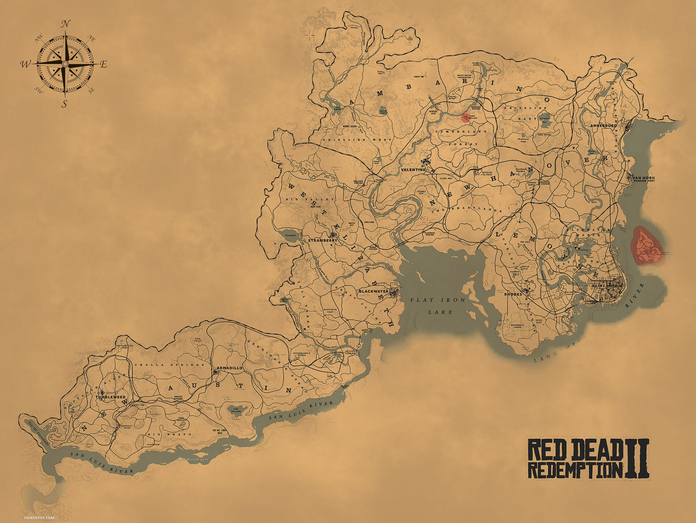

---
layout:
  title:
    visible: true
  description:
    visible: false
  tableOfContents:
    visible: true
  outline:
    visible: false
  pagination:
    visible: true
---

# 📖 Lore du serveur

1889, la guerre fait rage entre les États Unis et le Mexique.

L'armée Américaine a été repoussée à West Elizabeth et fait face à l'armée Mexicaine pour l'empêcher de traverser la Dakota river.

Pour le moment les civils ont l'interdiction formelle de dépasser la Dakota River et sont donc cantonnés aux comtés de Lemoyne et New Hanover.

L'Ambarino quant à lui abrite une zone froide, sauvage et complètement dépeuplée.

<figure><figcaption></figcaption></figure>
